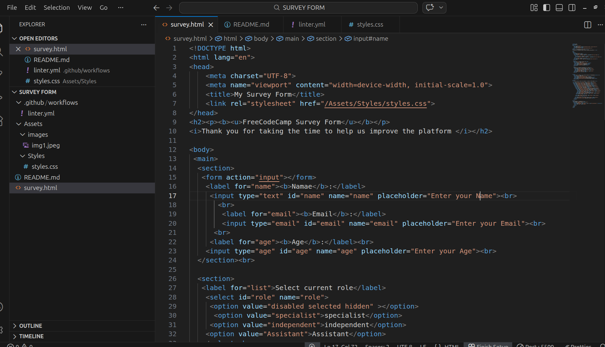

# SURVEY FORM

## Description

This is a simple HTML survey form that asks users information while tracking their data

## Features

- form
- radio buttons
- checkbox

## Installation

1. Clone the repository:
2. Navigate into the folder
3. Test the file and push

## Usage

Enter your info by filling the spaces

## Example

Enter your name,
enter your email,
enter your age

## image

## Contributing

Pull requests are welcome
